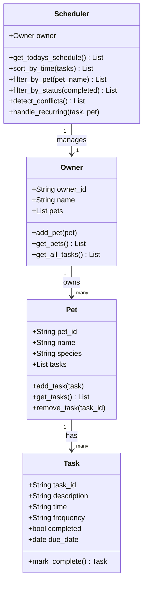

# PawPal+ UML Class Diagram

## Design Notes

### Relationships

- **Owner → Pet (1 to many):** One owner can have multiple pets. Each pet belongs to exactly one owner. The `Owner` class holds a list of `Pet` objects and exposes `add_pet()` / `get_pets()` to manage membership.

- **Pet → Task (1 to many):** One pet can have multiple scheduled tasks. Each task belongs to exactly one pet. The `Pet` class holds a list of `Task` objects and exposes `add_task()`, `get_tasks()`, and `remove_task()`.

- **Scheduler → Owner (1 to 1):** The `Scheduler` is initialised with a single `Owner` reference and operates over all pets and tasks reachable through that owner. It is a service class — it holds no persistent data of its own and delegates all storage to the `Owner`/`Pet`/`Task` hierarchy.

### Key Design Decisions

| Decision | Rationale |
|---|---|
| `Task` and `Pet` as dataclasses | Eliminates `__init__` boilerplate; fields are explicit and typed |
| `Owner` as a plain class | Needs mutable state management beyond what dataclass provides cleanly |
| `Scheduler` decoupled from `Owner` | Keeps business logic separate from data storage; easier to test |
| `due_date` on `Task` | Required for `timedelta`-based recurrence calculation |
| `time` stored as HH:MM string | Zero-padded strings sort identically to datetime objects for this format |
